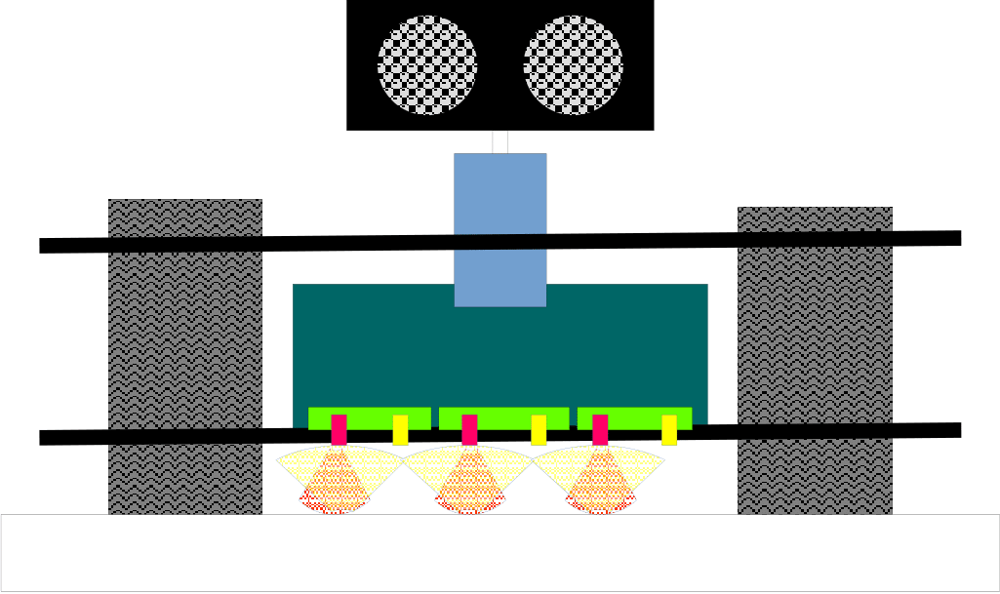
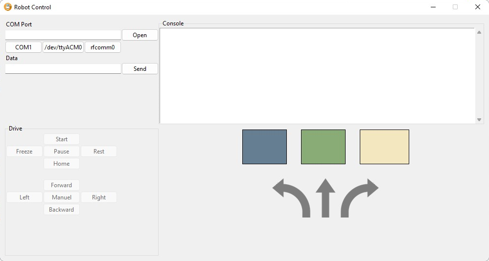

<h1 align="center" class="flex-container">
	

	Project Robot
	

	

	  <a href="https://github.com/{{cookiecutter.github_username}}/{{cookiecutter.repo_slug}}">
		<!-- Please provide path to your logo here -->
		
	  </a>
	

</h1>

> Small program for a line following robot which can accept a variety of instructions via a bluetooth connection. 

---
## About

---
## The robot
The project robot is based on an **ATmega328p** board which is equipped with three reflective optical sensors which are 
Used to follow a black line on a test ground. Furthermore, the robot was equipped with an shift register connected to 
three LEDs.

<h1 align="center">

</h1>

---
## Modes
The current mode is selected by sending the related key via a serial connection to the board.

| Mode   | Key | Description                                                                              |
|--------|-----|------------------------------------------------------------------------------------------|
| Drive  | S   | The robot should drive 3 rounds around the track, then stop and reset on the start field |
| Pause  | P   | The robot should do nothing and wait for the key to be entered again to leave this mode. |
| Home   | C   | Finish this round, then drive back to the start field and reset.                         |
| Freeze | X   | Save state! The robot reacts to nothing and waits for external reset.                    |
| Help   | ?   | Prints help text to the serial, if located on the start field.                           |

---
## User Interface
Implemented via python with the help of [tkinter](https://docs.python.org/3/library/tkinter.html). Can be used to send 
any text to the robot via a serial connection. Some "shortcut" buttons are also provided for all existing modes. 
Furthermore the current state of the field sensors can be seen and the direction that the robot is currently driving.
This is possible thanks to an ongoing message exchange between the robot and the user interface.

<h1 align="center">

</h1>

---
## Program Execution
This project makes heavy use of the "Makefile" shame for compilation, link and flashing to the board. 
Additionally, we use [Doxygen](https://doxygen.nl/) to generate the corresponding documentation for the **C** files.

The following targets are defined in the makefile:
- `compile`
  - Compiles all sources
- `link` 
  - Creates ".o" files for every C file in `./out/` and creates ".hex" file also in `./out/`
- `flash` 
  - Flashes the program on to the roboter
- `documentation` 
  - Creates doxygen docs at `./docs/` 
- `clean` 
  - Clears `./out/ ` directory, removes ".o" and ".hex" files